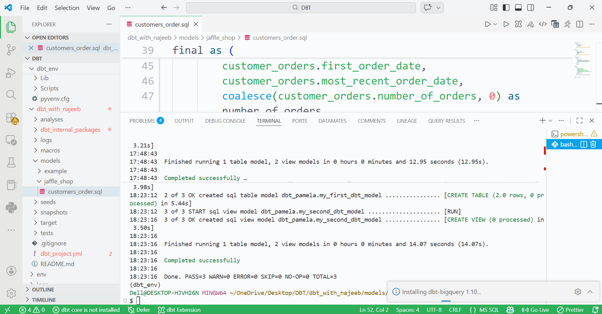
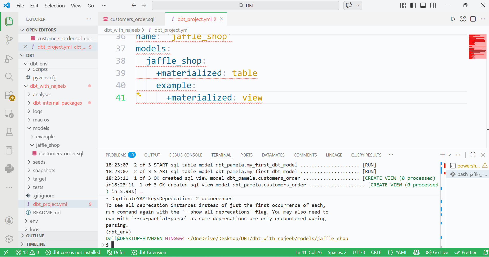
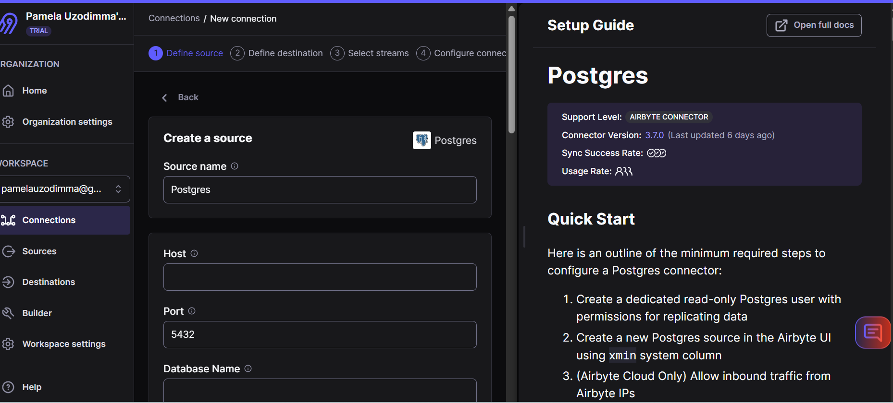
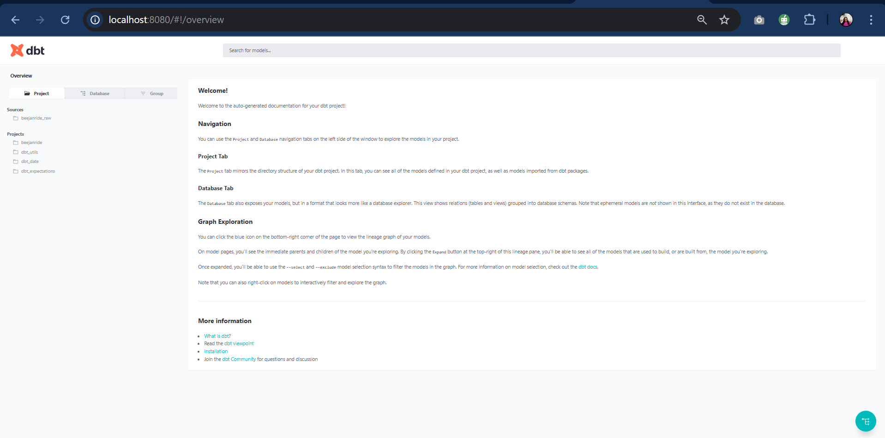
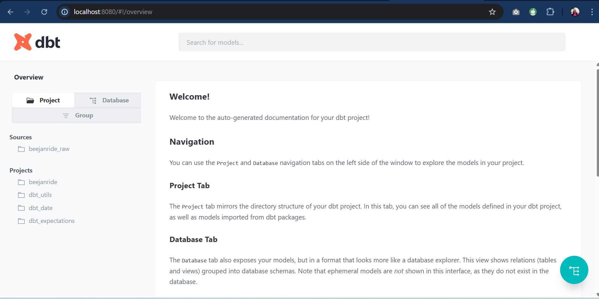

# 🚖 BeejanRide Analytics Platform

A production-grade dbt analytics platform for **BeejanRide** — a fast-growing UK mobility startup operating across 5 cities.

---

## 📐 Architecture
```
PostgreSQL (Supabase)
        │
        ▼
   [Airbyte]
        │
        ▼
BigQuery: beejanride_raw
        │
        ▼
   [dbt Core]
        │
   ┌────┴────┐
   ▼         ▼
staging   snapshots
   │
   ▼
intermediate
   │
   ▼
  marts
(fct_trips, fct_payments, dim_drivers, dim_riders)
```

---

## 🗂️ Project Structure
```
beejanride-dbt/
├── models/
│   ├── staging/          # Raw → cleaned views
│   ├── intermediate/     # Reusable business logic (ephemeral)
│   └── marts/
│       ├── finance/      # fct_trips, fct_payments
│       ├── drivers/      # dim_drivers
│       └── riders/       # dim_riders
├── snapshots/            # SCD Type 2 — drivers
├── macros/               # calculate_net_revenue, is_fraud_indicator
├── tests/                # Custom data quality tests
├── seeds/                # Sample raw data (dev)
├── analyses/             # Sample analytical queries
└── docs/                 # Airbyte config, architecture docs
```

---

## 🛠️ Tech Stack

| Layer | Tool |
|-------|------|
| Ingestion | Airbyte |
| Warehouse | BigQuery (Google Cloud) |
| Transformation | dbt Core 1.11 |
| Version Control | GitHub |
| Language | SQL |

---

## 📊 Data Model (ERD)
```
trips_raw ──────────── drivers_raw
    │                       │
    │                   cities_raw
    │
payments_raw
    │
riders_raw
```

### Raw Tables
| Table | Rows (seed) | Description |
|-------|-------------|-------------|
| trips_raw | 15 | All ride records |
| drivers_raw | 8 | Driver profiles |
| riders_raw | 10 | Rider profiles |
| payments_raw | 14 | Payment transactions |
| cities_raw | 5 | Operating cities |
| driver_status_events_raw | 20 | High-volume driver events |

---

## 🏗️ Layered Architecture

### Staging Layer
- One model per source table
- Renames columns to snake_case
- Casts correct data types
- Deduplicates using primary keys
- Standardizes timestamps
- Removes null primary keys
- stg_driver_status_events uses incremental materialization (high volume)

### Intermediate Layer
- Ephemeral models embedded into downstream queries
- int_trips_enriched — trip duration, net revenue, fraud flags
- int_driver_metrics — lifetime trips, revenue, churn detection
- int_rider_metrics — LTV, segment classification
- int_payment_analysis — failed payments, amount mismatches

### Marts Layer
- Star schema: fact + dimension tables
- fct_trips — partitioned by date, clustered by city + driver
- fct_payments — all payment attempts including failures
- dim_drivers — enriched with tier, churn, city info
- dim_riders — enriched with LTV segment, payment preferences

---

## 📸 Incremental Models

### Why Incremental?
fct_trips and stg_driver_status_events use incremental materialization because:
- Trip data grows daily — full refresh scans entire history unnecessarily
- driver_status_events_raw is a high volume append-only table
- Incremental reduces BigQuery costs and improves run time

### Full Refresh vs Incremental

| | Full Refresh | Incremental |
|--|--|--|
| Cost | High (scans all data) | Low (new rows only) |
| Speed | Slow at scale | Fast |
| Simplicity | Simple | Requires watermark logic |
| Risk | Safe — rebuilds cleanly | Late-arriving data may be missed |
| Use when | Schema changes, backfills | Daily production runs |

---

## 🔍 Data Quality

### Generic Tests (64 total)
- not_null on all primary keys
- unique on all primary keys
- accepted_values on all status/enum columns

### Custom Tests (3)
| Test | Description |
|------|-------------|
| assert_no_negative_revenue | No completed trip has negative fare |
| assert_trip_duration_positive | Completed trips have duration > 0 |
| assert_completed_trip_has_payment | Every completed trip has a successful payment |

### Freshness Tests
- trips_raw: warn after 1 hour, error after 2 hours
- driver_status_events_raw: warn after 30 mins, error after 1 hour

---

## 📸 Snapshots (SCD Type 2)

drivers_snapshot tracks historical changes to:
- driver_status (active → suspended → inactive)
- vehicle_id (vehicle reassignments)
- driver_rating (rating updates)

Uses check strategy on BigQuery for type compatibility.

---

## 🚨 Fraud Detection Logic

| Indicator | Logic |
|-----------|-------|
| Extreme surge | surge_multiplier > 10 |
| Duplicate payment | Same trip has more than 1 successful payment |
| Failed payment on completed trip | Trip completed but no successful payment recorded |
| Amount mismatch | Payment amount differs from actual fare by more than £1 |

---

## 📈 Supported Analytics Use Cases

| Use Case | Model |
|----------|-------|
| Daily revenue per city | fct_trips |
| Gross vs net revenue | fct_trips |
| Corporate vs personal split | fct_trips |
| Top drivers by revenue | dim_drivers |
| Driver activity monitoring | dim_drivers + stg_driver_status_events |
| Rider lifetime value | dim_riders |
| Payment failure rate | fct_payments |
| Surge impact analysis | fct_trips |
| Driver churn tracking | dim_drivers |
| Fraud detection insights | fct_trips |

---

## ⚙️ Airbyte Ingestion

See docs/airbyte/airbyte_config.md for full configuration.

Source: PostgreSQL on Supabase (aws-1-eu-west-1.pooler.supabase.com)
Destination: BigQuery dataset beejanride_raw
Sync Mode: Full Refresh / Overwrite (Incremental / Append for events)

Note: During development, dbt seed files simulate Airbyte ingestion.
The Airbyte configuration is fully documented and production-ready.

---

## 🚀 Getting Started
```bash
# Install dependencies
pip install dbt-bigquery

# Authenticate
gcloud auth application-default login

# Install dbt packages
dbt deps

# Load seed data
dbt seed

# Run all models
dbt build

# Generate docs
dbt docs generate
dbt docs serve
```

---

## 🔮 Future Improvements

- Connect Airbyte to live PostgreSQL and replace seed data
- Add dbt Exposures for dashboard dependencies
- Implement dbt metrics layer for standardised KPIs
- Add CI/CD pipeline via GitHub Actions
- Add row-count monitoring with dbt_utils.equal_rowcount
- Expand fraud detection with ML anomaly scoring
- Add dim_vehicles and dim_dates for full star schema

---

## 🎯 Design Decisions

1. Ephemeral intermediate models — avoids storing redundant tables, keeps lineage clean
2. Incremental fct_trips — production-ready for scale, reduces BigQuery scan costs
3. Check strategy snapshot — avoids BigQuery DATETIME/TIMESTAMP type conflicts
4. Seed data for dev — unblocks development without waiting for Airbyte credentials
5. Star schema marts — optimised for BI tool consumption and analytical queries

---

## ⚖️ Tradeoffs

| Decision | Tradeoff |
|----------|----------|
| Ephemeral intermediate | Faster runs but harder to debug intermediate results |
| Incremental models | Lower cost but requires careful watermark management |
| Seed data | Fast dev cycle but not representative of full production volume |
| OAuth auth | Easy setup but not suitable for automated production pipelines |

---

## 👤 Author
Pamela Uzodimma
Data Engineering Project — BeejanRide Analytics Platform
Built with dbt Core + BigQuery + Airbyte

---

## 📸 Screenshots

### dbt Lineage Graph


### dbt Lineage (Full View)


### Airbyte Sync


### BigQuery Dataset


### dbt Build Results

